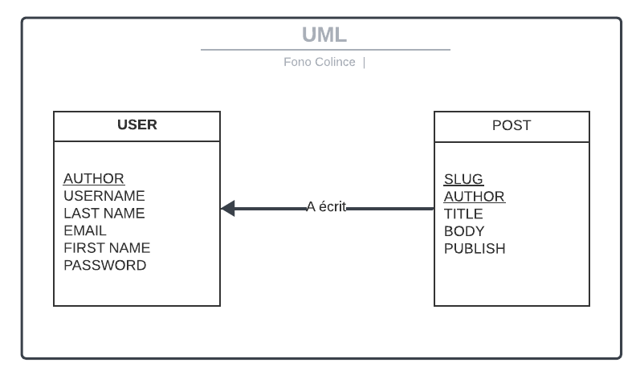
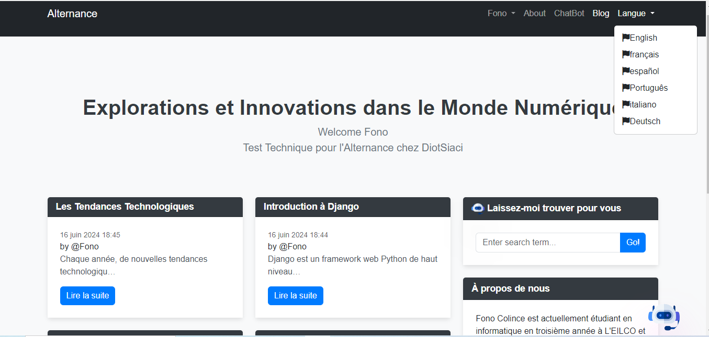

# Projet Django Multilingue avec Intégration de LLM

Ce projet est développé dans le cadre du test technique pour une alternance chez Diot-Siaci. L'objectif est de créer un site Django simple et multilingue, avec la possibilité d'intégrer des modèles de langage (LLM) pour des fonctionnalités de chatbot et de recherche augmentée par intelligence artificielle (RAG).

## Lien de Déploiement

Le projet a été déployé sur Render.com et peut être consulté à l'adresse suivante :

[Consulter le déploiement du projet](https://test-technique-fono-colince.onrender.com/)


## Sommaire
-[UML](#UML)
- [Temps Mis pour la Réalisation](#temps-mis-pour-la-réalisation)
- [Étapes Réalisées](#étapes-réalisées)
  - [Installation et Configuration de Django](#1-installation-et-configuration-de-django)
  - [Modèles et Vue de Base](#2-modèles-et-vue-de-base)
  - [Internationalisation](#3-internationalisation)
  - [Interface Utilisateur](#4-interface-utilisateur)
  - [Utilisation de Modèles de Langage (LLM)](#5-utilisation-de-modèles-de-langage-llm-et-rag-optionnel)
  - [Documentation](#6-documentation)
- [Exécution du Projet](#exécution-du-projet)
- [Ressources Utilisées](#ressources-utilisées)
-[DEMO](#DEMO)
- [Lien de Déploiement](#lien-de-déploiement)

## UML



## Temps Mis pour la Réalisation

La réalisation de ce projet s'est étendue sur une période de 10 jours. Chaque jour a été consacré à différentes étapes clés, allant de la configuration initiale de Django, à l'implémentation des fonctionnalités multilingues, jusqu'à l'intégration des modèles de langage (LLM) pour les fonctionnalités avancées.

## Étapes Réalisées

### 1. Installation et Configuration de Django

- Création du projet Django nommé `multilang_site`.
- Mise en place de l'application `main` pour gérer les articles de blog.
- Utilisation de GitHub pour versionner le code et Render.com pour le déploiement.

### 2. Modèles et Vue de Base

- Définition du modèle `Post` pour gérer les articles de blog avec les champs `title`, `content`, et `publication_date`.
- Implémentation d'une vue pour afficher une liste d'articles sur le site.

### 3. Internationalisation

- Configuration du projet pour supporter l'internationalisation (i18n).
- Ajout des langues française (fr) et anglaise (en), ainsi que d'autres langues.
- Traduction des éléments statiques de l'interface utilisateur.

### 4. Interface Utilisateur

- Développement de templates pour l'affichage des articles de blog selon la langue choisie.
- Ajout d'une fonctionnalité permettant aux utilisateurs de changer la langue de l'interface.

#### Nouvelles Fonctionnalités

- `Création de Compte Utilisateur :`
Les utilisateurs peuvent créer un compte en s'inscrivant avec leur nom, adresse e-mail et mot de passe. L'inscription est simple et sécurisée, et permet aux utilisateurs de gérer leurs informations personnelles et de pers

- `Connexion et Déconnexion :`
Les utilisateurs inscrits peuvent se connecter à leur compte pour accéder à des fonctionnalités supplémentaires.

- `Ajout de Nouveaux Articles :`
Une fois connectés, les utilisateurs ont la possibilité d'ajouter de nouveaux articles de blog. Ils peuvent utiliser un formulaire intuitif pour saisir le titre et le contenu de l'article

- `Consultation du Profil Utilisateur :`
Les utilisateurs peuvent accéder à leur page de profil pour consulter

### 5. Utilisation de Modèles de Langage (LLM)

- Intégration d'un chatbot basé sur un modèle de langage (GPT) pour répondre aux questions des utilisateurs.
- Mise en place d'une fonctionnalité de recherche augmentée.

### 6. Documentation

- Rédaction d'un fichier README.md détaillant les étapes réalisées et les fonctionnalités du projet.
- Ajout de commentaires dans le code pour expliquer les parties clés et l'utilisation de ChatGPT lorsque applicable.

## Exécution du Projet

Suivez ces étapes pour installer et exécuter le projet sur votre machine locale :

```bash
# 1. Cloner le Repository
git clone <url_du_repository>
cd <nom_du_dossier_du_projet>

# 2. Créer un Environnement Virtuel
python -m venv env

# 3. Activer l'Environnement Virtuel
# Pour Windows :
env\Scripts\activate.bat
# Pour Linux ou macOS :
source env/bin/activate

# 4. Installer les Dépendances
pip install -r requirements.txt

# 5. Configurer le Projet
cd multilang_site

# 6. Appliquer les Migrations
python manage.py migrate

# 7. Exécuter le Serveur de Développement
python manage.py runserver

# Ouvrez votre navigateur web et accédez à :
http://127.0.0.1:8000/

```

## Ressources Utilisées

Pour la réalisation de ce projet, plusieurs ressources ont été utilisées afin d'améliorer et de faciliter le développement. Voici un résumé des principales ressources :

### 1. ChatGPT

- **Scripts JavaScript** : Assistance dans l'écriture et l'optimisation des scripts JavaScript et css pour améliorer le frontend de l'application.

### 2. Documentation de Django

- **Fonctionnalités de Base** : Consultation régulière de la documentation officielle de Django pour la création de modèles, vues et templates.
- **Internationalisation** : Référence pour configurer l'internationalisation (i18n) dans le projet.

### 3. Autres Ressources en Ligne

- **Bootstrap** : Utilisation de la bibliothèque Bootstrap pour améliorer le design et la réactivité de l'interface utilisateur.
- **Stack Overflow** : Recherche de solutions à des problèmes techniques spécifiques rencontrés pendant le développement.

Ces ressources ont été cruciales pour surmonter les défis techniques et réussir à mener à bien ce projet.

## DEMO 



[Consulter le déploiement du projet](https://test-technique-fono-colince.onrender.com/)

